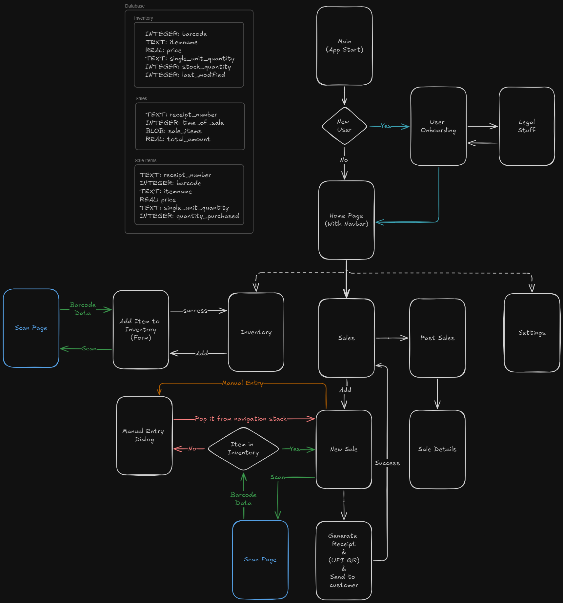

# Mobile PoS
Inventory management & Point of Sales app for small businesses.

#  AppFlow & DB Structure

# Build
JDK version used: 17.0.11  
Flutter version: 3.10.6  
Android min SDK: 28  
Android target SDK: 34  

Follow Flutter guidelines for builds for [android](https://docs.flutter.dev/deployment/android) & [ios](https://docs.flutter.dev/deployment/ios)

Build command (android apk): `flutter build apk`

# Attribution
App Logo: `Barcode Scanner SVG Vector` by `Global Logistics 2` -- https://www.svgrepo.com/svg/192517/barcode-scanner  
Beep Sound: `beep.wav` by `anthonychartier2020` -- https://freesound.org/s/341278/ [License: Attribution 4.0]  
Font: `Caveat` -- https://fonts.google.com/specimen/Caveat  
List of countries, code, calling code, currency, GS1 prefix: [Country Codes](https://en.wikipedia.org/wiki/List_of_ISO_3166_country_codes), [Calling Codes](https://en.wikipedia.org/wiki/List_of_country_calling_codes), [Currency](https://en.wikipedia.org/wiki/List_of_circulating_currencies), [GS1 Prefix](https://en.wikipedia.org/wiki/List_of_GS1_country_codes)  
List of countries accepting UPI: https://www.npci.org.in/who-we-are/group-companies/npci-international/list-of-countries 
